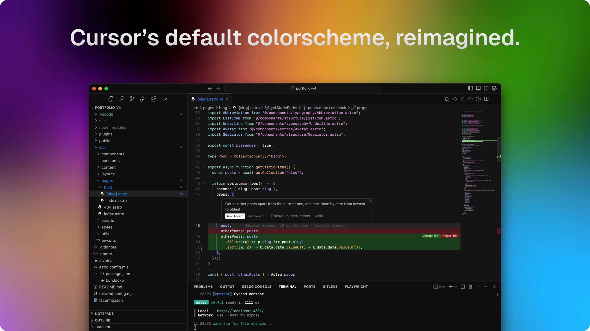

# Cursor Anysphere Theme

The original Anysphere theme for Cursor, now available for VS Code. This theme enhances your coding experience with carefully chosen colors and contrasts that match the Cursor editor experience.

## Installation

1. Open **Extensions** sidebar panel in VS Code. `View → Extensions`
2. Search for `Cursor Anysphere Theme`
3. Click **Install**
4. Click **Reload**
5. File > Preferences > Color Theme > **Anysphere Dark**

## Features

- The original Anysphere theme from Cursor
- Carefully selected colors for optimal contrast and readability
- Consistent syntax highlighting across multiple languages
- Optimized for long coding sessions
- Dark theme that's easy on the eyes

## License

This theme is released under the MIT License. See the [LICENSE](LICENSE) file for details. 